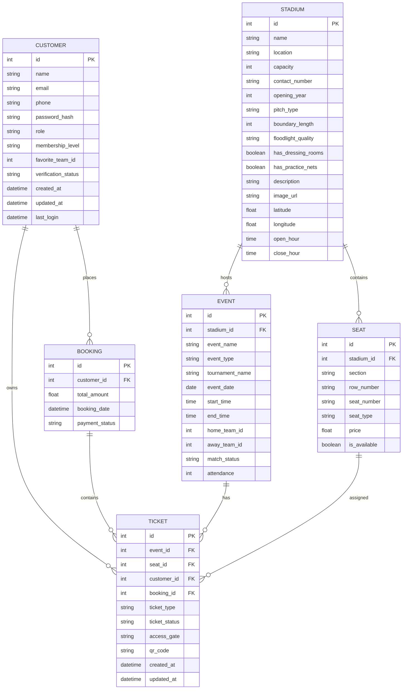

# Database Schema

## Overview

This document describes the database schema for the CricVerse application, including all tables and their relationships.

## Entity Relationship Diagram

## Table Descriptions

### CUSTOMER
Stores information about users of the system.

**Columns:**
- `id` (Primary Key): Unique identifier for the customer
- `name`: Customer's full name
- `email`: Customer's email address (unique)
- `phone`: Customer's phone number
- `password_hash`: Hashed password for authentication
- `role`: User role (customer, admin, stadium_owner)
- `membership_level`: Membership tier (Basic, Premium, VIP)
- `favorite_team_id`: ID of the customer's favorite team
- `verification_status`: Account verification status
- `created_at`: Timestamp when the account was created
- `updated_at`: Timestamp when the account was last updated
- `last_login`: Timestamp of the last login

### BOOKING
Stores information about ticket bookings.

**Columns:**
- `id` (Primary Key): Unique identifier for the booking
- `customer_id` (Foreign Key): References CUSTOMER.id
- `total_amount`: Total amount paid for the booking
- `booking_date`: Timestamp when the booking was made
- `payment_status`: Status of the payment (Pending, Completed, Failed, Cancelled)

### TICKET
Stores information about individual tickets.

**Columns:**
- `id` (Primary Key): Unique identifier for the ticket
- `event_id` (Foreign Key): References EVENT.id
- `seat_id` (Foreign Key): References SEAT.id
- `customer_id` (Foreign Key): References CUSTOMER.id
- `booking_id` (Foreign Key): References BOOKING.id
- `ticket_type`: Type of ticket (Single Match, Season, Hospitality)
- `ticket_status`: Status of the ticket (Booked, Used, Cancelled, Transferred)
- `access_gate`: Gate through which the ticket holder can enter
- `qr_code`: Path to the QR code image for the ticket
- `created_at`: Timestamp when the ticket was created
- `updated_at`: Timestamp when the ticket was last updated

### EVENT
Stores information about events (matches).

**Columns:**
- `id` (Primary Key): Unique identifier for the event
- `stadium_id` (Foreign Key): References STADIUM.id
- `event_name`: Name of the event
- `event_type`: Type of event (Match, Practice, Event)
- `tournament_name`: Name of the tournament
- `event_date`: Date of the event
- `start_time`: Start time of the event
- `end_time`: End time of the event
- `home_team_id`: ID of the home team
- `away_team_id`: ID of the away team
- `match_status`: Status of the match (Scheduled, In Progress, Completed)
- `attendance`: Number of attendees

### SEAT
Stores information about stadium seating.

**Columns:**
- `id` (Primary Key): Unique identifier for the seat
- `stadium_id` (Foreign Key): References STADIUM.id
- `section`: Section of the stadium (e.g., A, B, C)
- `row_number`: Row number within the section
- `seat_number`: Seat number within the row
- `seat_type`: Type of seat (Standard, Premium, VIP)
- `price`: Price of the seat
- `is_available`: Whether the seat is available for booking

### STADIUM
Stores information about stadiums.

**Columns:**
- `id` (Primary Key): Unique identifier for the stadium
- `name`: Name of the stadium
- `location`: Location of the stadium
- `capacity`: Seating capacity of the stadium
- `contact_number`: Contact phone number
- `opening_year`: Year the stadium was opened
- `pitch_type`: Type of cricket pitch
- `boundary_length`: Length of the boundary
- `floodlight_quality`: Quality of floodlighting
- `has_dressing_rooms`: Whether the stadium has dressing rooms
- `has_practice_nets`: Whether the stadium has practice nets
- `description`: Description of the stadium
- `image_url`: URL to an image of the stadium
- `latitude`: Latitude coordinate
- `longitude`: Longitude coordinate
- `open_hour`: Opening time
- `close_hour`: Closing time

## Relationships

1. **CUSTOMER → BOOKING**: One-to-many relationship. A customer can place multiple bookings.
2. **CUSTOMER → TICKET**: One-to-many relationship. A customer can own multiple tickets.
3. **BOOKING → TICKET**: One-to-many relationship. A booking can contain multiple tickets.
4. **EVENT → TICKET**: One-to-many relationship. An event can have multiple tickets.
5. **SEAT → TICKET**: One-to-many relationship. A seat can be assigned to multiple tickets (over different events).
6. **STADIUM → SEAT**: One-to-many relationship. A stadium contains multiple seats.
7. **STADIUM → EVENT**: One-to-many relationship. A stadium can host multiple events.

## Indexes

The following indexes are recommended for optimal performance:

1. `idx_customer_email` on CUSTOMER.email
2. `idx_booking_customer_id` on BOOKING.customer_id
3. `idx_ticket_event_id` on TICKET.event_id
4. `idx_ticket_seat_id` on TICKET.seat_id
5. `idx_event_stadium_id` on EVENT.stadium_id
6. `idx_event_date` on EVENT.event_date
7. `idx_seat_stadium_id` on SEAT.stadium_id

## Constraints

1. **Primary Keys**: Each table has a primary key constraint on its ID column.
2. **Foreign Keys**: Referential integrity is maintained through foreign key constraints.
3. **Unique Constraints**: 
   - CUSTOMER.email must be unique
4. **Check Constraints**:
   - TICKET.ticket_status must be one of ('Booked', 'Used', 'Cancelled', 'Transferred')
   - BOOKING.payment_status must be one of ('Pending', 'Completed', 'Failed', 'Cancelled')